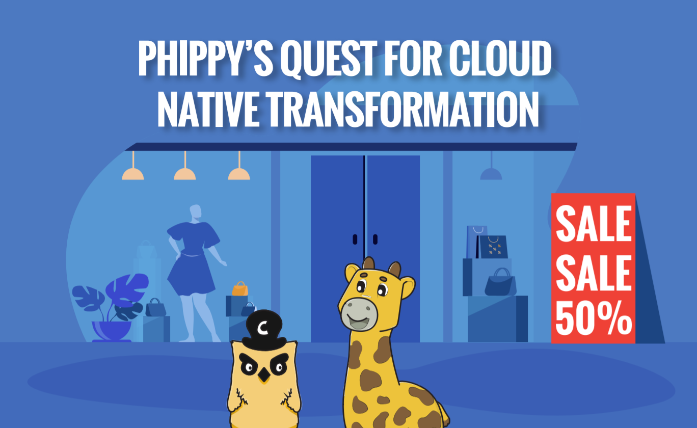

# Phippy’s Quest for Cloud Native Transformation

Join Phippy and friends on a journey towards cloud native. This time
Phippy and Captain Kube have put up their engineering hats. Captain
Kube will help Phippy understand what is cloud native by covering key
points. Download the comic book to get started reading.

[**Download Comic Book**](https://github.com/infracloudio/phippy-cloud-native-transformation/blob/main/phippys-quest-for-cloudnative-transformation-comic.pdf)

## Licensing & Credits
The concept and dialouges of “Phippy’s Quest for Cloud Native
Transformation” is copyright InfraCloud Technologies Inc. and is
licensed under Creative Commons Attribution 4.0 International
(CC-BY-4.0).

The topics on which this comic book is based on are from the book
“Cloud Native DevOps with Kubernetes” by John Arundel & Justin
Domingus.

The illustration of Goldie is based on the Go Gopher designed by Renée
French and is licensed under Creative Commons Attribution 3.0
(CC-BY-3.0).

Phippy and Captain Kube are copyright The Linux Foundation, on behalf
of the Cloud Native Computing Foundation. They are licensed under
Creative Commons Attribution 4.0 International (CC-BY-4.0). See
phippy.io.

Kubernetes®, CNI™ and CSI along with their logos are trademarks of The
Linux Foundation. See linuxfoundation.org.

Other illustrations are by macrovector / macrovector_official /
pch.vector / pikisuperstar / rawpixel.com / vectorjuice /
Freepik. These are licensed under Freepik Licence. See
freepik.com. You can find all the links
[here](./LICENSE.md#links-to-freepik-resources).

